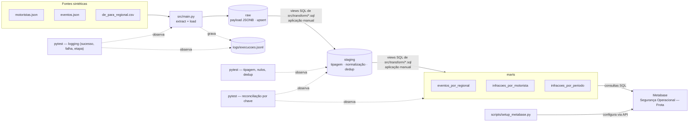

# Pipeline de Telemetria de Frota

Pipeline de dados que consolida telemetria de frota, cadastro de colaboradores e
classificação organizacional em um único banco analítico, com painéis de segurança
operacional construídos sobre ele.

**Stack:** Python · PostgreSQL · Docker · Metabase

> **Sobre os dados:** este repositório usa exclusivamente dados sintéticos, gerados
> pelo script incluído. Nenhum dado pessoal, operacional ou corporativo real é
> versionado aqui. A arquitetura é real; os dados não.

---

## O problema

Uma operação de campo com centenas de motoristas gera dados de segurança em três
lugares que não se conversam:

| Fonte | O que tem | O problema |
|---|---|---|
| API de telemetria | Eventos de direção (excesso de velocidade, frenagem brusca, uso de celular) | Não sabe a que regional o motorista pertence |
| Planilhas de cadastro | Matrícula, regional, centro de custo | Mantidas à mão, com lacunas e sem integração |
| Sistemas internos | Registros complementares de segurança | Cada um com seu próprio painel |

O resultado prático: cada gestor olha um painel diferente, ninguém consegue responder
"quais regionais concentram os eventos mais graves?" sem cruzar planilha na mão, e a
decisão chega atrasada em relação ao fato.

O gargalo não é falta de dado. É falta de conexão entre os dados.

---

## A solução



Três camadas de dados no PostgreSQL, cada uma com uma responsabilidade única:

1. **raw** — payload JSONB fiel à fonte, carregado por upsert via `src/main.py`
   (extract + load). Nenhuma transformação acontece aqui.
2. **staging** — views SQL que tipam, normalizam, relacionam (JOIN com o de-para
   regional) e deduplicam por chave natural, mantendo sempre o `loaded_at` mais
   recente.
3. **marts** — três views analíticas (`eventos_por_regional`,
   `infracoes_por_motorista`, `infracoes_por_periodo`), consumidas exclusivamente
   pelo Metabase — nunca a camada raw diretamente.

---

## Decisões de arquitetura

**Por que Metabase e não Power BI?**
A organização não tinha licenças Power BI Pro, e o custo por usuário inviabilizava
distribuir painéis para toda a operação. O Metabase é open source, roda em container,
e o custo marginal de mais um usuário é zero. Trade-off aceito: menos recursos de
modelagem visual que o Power BI oferece.

**Por que PostgreSQL e não direto no BI?**
Conectar a ferramenta de BI diretamente nas APIs parece mais simples, mas amarra a
lógica de negócio dentro do painel — onde ela não é versionável nem testável. Com o
banco no meio, a regra de negócio vive em SQL sob controle de versão, e o painel vira
só apresentação.

**Por que Docker?**
O ambiente inteiro (banco + BI) sobe com um comando. Isso importou por um motivo
prático: o projeto começou como protótipo local antes de existir servidor aprovado.
Quando a infraestrutura veio, subir em outra máquina foi questão de rodar o mesmo
compose.

**Por que a regional vem de planilha e não da API?**
Porque na origem ela simplesmente não existe — o campo de agrupamento vem vazio na
prática. Em vez de fingir que o dado é limpo, o pipeline trata isso explicitamente:
existe um de-para, ele tem lacunas, e o modelo precisa lidar com motorista sem
regional atribuída. Esconder essa imperfeição tornaria o projeto mais bonito e menos
verdadeiro.

---

## Rodando o projeto

Pré-requisitos: Python 3.12+, Docker Desktop.

```bash
git clone https://github.com/vinibrum10/pipeline-telemetria-frota.git
cd pipeline-telemetria-frota

cp .env.example .env
# os valores padrão já funcionam para rodar local; ajuste se quiser

docker compose up -d
# sobe Postgres (cria os schemas raw/staging/marts automaticamente, via
# db/init) e Metabase. Confira com `docker compose ps` que o Postgres
# está "healthy" antes de seguir.

python -m venv .venv
.venv\Scripts\Activate.ps1        # Windows
# source .venv/bin/activate       # Linux/macOS

pip install -r requirements.txt
python scripts/gerar_dados_fake.py     # gera os dados sintéticos em data/seed/
python -m src.main                     # extract + load: fontes -> schema raw

# Este bloco usa sintaxe Bash. No Windows, rode-o pelo Git Bash ou WSL
# (o restante do projeto funciona em PowerShell; só esta parte exige Bash).
set -a && source .env && set +a        # exporta as variáveis do .env para o shell
for f in src/transform/*.sql; do
  docker compose exec -T postgres psql -U "$POSTGRES_USER" -d "$POSTGRES_DB" < "$f"
done
# aplica, na ordem numérica dos arquivos, as views de staging e marts

python scripts/setup_metabase.py
```

Configura o Metabase automaticamente — cria o usuário admin (se necessário), conecta ao Postgres, e recria as 4 perguntas e o dashboard "Segurança Operacional — Frota" via API.

Para conferir o resultado, abra `http://localhost:${METABASE_PORT}` (o valor
definido no seu `.env` — por padrão `http://localhost:3000`), entre com o
e-mail/senha definidos lá (`METABASE_ADMIN_EMAIL` / `METABASE_ADMIN_PASSWORD`)
e veja o dashboard "Segurança Operacional — Frota". Para rodar os testes
automatizados, com os containers de pé: `pytest`.

> **Isolamento do banco de testes:** `pytest` usa exclusivamente o banco
> definido em `POSTGRES_TEST_DB` (padrão `elo_test`), nunca o banco
> operacional `POSTGRES_DB`. O banco de teste é criado automaticamente na
> primeira execução, se ainda não existir. Isso existe porque os testes de
> integração truncam suas tabelas a cada execução — rodá-los contra o banco
> operacional apagaria os dados carregados pelo pipeline.

O passo de gerar dados sintéticos, acima, produz em `data/seed/`:

| Arquivo | Conteúdo |
|---|---|
| `motoristas.json` | 414 motoristas no formato da API de telemetria |
| `eventos.json` | ~8.500 eventos de direção ao longo de 90 dias |
| `de_para_regional.csv` | Mapeamento matrícula → regional (com lacunas propositais) |

Parâmetros: `--motoristas`, `--dias`, `--eventos-por-dia`, `--seed`.
A seed é fixa por padrão, então o dataset é reprodutível — quem clonar gera exatamente
os mesmos registros.

---

## Sobre os dados sintéticos

O gerador não produz dado aleatório uniforme. Ele reproduz três características do
dado real que importam para o resultado:

**Distribuição de Pareto nos eventos.** Uma minoria de motoristas concentra a maior
parte das ocorrências. Com distribuição uniforme, o painel de ranking não teria sinal
nenhum — todos empatariam, e o dashboard não serviria para decidir nada.

**Dado incompleto no de-para.** Cerca de 3% das linhas sem regional preenchida.
Planilha mantida à mão sempre tem buraco, e o pipeline precisa tratar isso.

**Campo de agrupamento vazio na API.** Replica a lacuna real que justifica a existência
do de-para.

CPFs são gerados com dígito verificador válido, mas fictícios — permitem exercitar
validação e formatação sem envolver nenhum documento real.

---

## Estado atual e próximos passos

Concluído:

- [x] Extração da API de telemetria
- [x] Carga em PostgreSQL (staging), com testes de lógica e qualidade de dado
- [x] Camada de marts: eventos_por_regional, infracoes_por_motorista, infracoes_por_periodo — todas com testes automatizados no repositório e primeiras visualizações validadas no Metabase
- [x] Ambiente containerizado (Postgres + Metabase)
- [x] Gerador de dados sintéticos
- [x] Dashboard consolidado no Metabase, reproduzível via `scripts/setup_metabase.py`, que recria a conexão com o banco, as 4 perguntas e o dashboard via API em uma instância nova
- [x] Diagrama de arquitetura documentando fluxo de dados, aplicação manual das views e testes de contrato
- [x] Fechamento de qualidade e observabilidade: testes de contagem/duplicidade, log de execução e observabilidade mínima

Limitações / evoluções futuras:

- Atualização do pipeline ainda é manual; orquestração/agendamento poderá ser adicionada em evolução futura se houver necessidade que justifique a complexidade

## Log de execução

Cada execução de `python -m src.main` grava uma linha em `logs/execucoes.jsonl`
(formato [JSON Lines](https://jsonlines.org/) - um objeto JSON por linha, um por
execução). O arquivo é gerado localmente e ignorado pelo Git (`logs/*.jsonl` no
`.gitignore`); a tabela abaixo é a referência para interpretá-lo.

| Campo | Tipo | Descrição |
|---|---|---|
| `execucao_id` | string (UUID) | Identificador único da execução |
| `inicio` / `fim` | string (ISO 8601, UTC) | Início e fim da execução |
| `duracao_segundos` | number | Duração total, em segundos |
| `status` | `"sucesso"` \| `"falha"` | Resultado da execução |
| `etapa_falha` | string \| `null` | Etapa onde o erro ocorreu (`leitura_fontes`, `conexao`, `carga_motoristas`, `carga_eventos`, `carga_regionais`); `null` quando `status` é `"sucesso"` |
| `motoristas_processados` | int \| `null` | Registros lidos e enviados ao upsert por `load_motoristas` |
| `eventos_processados` | int \| `null` | Registros lidos e enviados ao upsert por `load_eventos` |
| `de_para_processados` | int \| `null` | Registros lidos e enviados ao upsert por `load_de_para_regional` |
| `erro` | string \| `null` | Mensagem da exceção, quando `status` é `"falha"` |

**Nota sobre "processados"**: as contagens refletem quantos registros foram
lidos da fonte e enviados ao upsert - não necessariamente quantas linhas
foram de fato inseridas vs. atualizadas no banco (o upsert em
`raw_loader.py` não distingue as duas coisas).

Exemplo de linha (execução com sucesso):

    {"execucao_id": "a1b2c3d4-...", "inicio": "2026-08-21T18:00:00+00:00", "fim": "2026-08-21T18:00:08+00:00", "duracao_segundos": 8.312, "status": "sucesso", "etapa_falha": null, "motoristas_processados": 42, "eventos_processados": 310, "de_para_processados": 42, "erro": null}

## O que eu faria diferente

**Teria começado pelo modelo dimensional.** Comecei carregando dados brutos e pensando
na modelagem depois. Funcionou, mas refazer a estrutura de fatos e dimensões com dados
já carregados custou retrabalho que uma hora de desenho no início teria evitado.

**Teria separado dado real e dado de exemplo desde o primeiro commit.** O repositório
original nasceu com dados reais no histórico do Git, o que inviabilizou torná-lo
público — foi necessário recomeçar do zero. Histórico de Git é permanente; decidir
sobre dado sensível depois é decidir tarde demais.

**Ainda não resolvi a orquestração.** Hoje a atualização é manual. A escolha entre um
agendador simples e um orquestrador completo é a próxima decisão em aberto, e a
resposta honesta é que ainda não tenho volume suficiente para justificar a complexidade
do segundo.

---

## Contexto

Este projeto nasceu de um problema real que enfrentei liderando uma equipe de segurança
do trabalho no setor de energia: painéis que não se conversavam e decisões tomadas com
dado defasado. A versão publicada aqui é uma reconstrução com dados sintéticos,
preservando a arquitetura e as decisões técnicas.

**Vinícius Brum** — Engenheiro, atuando na interseção entre operação de infraestrutura
crítica e engenharia de dados.
[GitHub](https://github.com/vinibrum10)